# Authentik Setup Instructions

### Have logout flow downloaded to your machine and ready

Go to http://\<your server\'s IP or
hostname\>:\<port\>/if/flow/initial-setup/ to begin authentik
initialization

Click on admin interface \> flows and stages \> flows

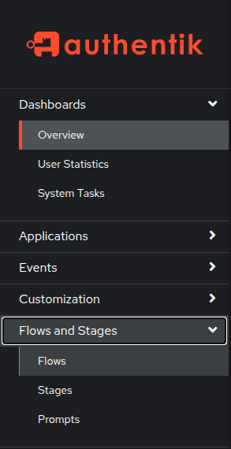

Select Import:

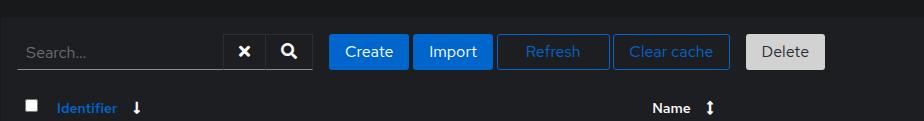

Select the logout flow file you were provided

Select Import

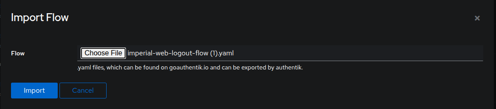

Select the newly imported imperial-web-logout-flow from the list by
clicking on its name under Invalidation

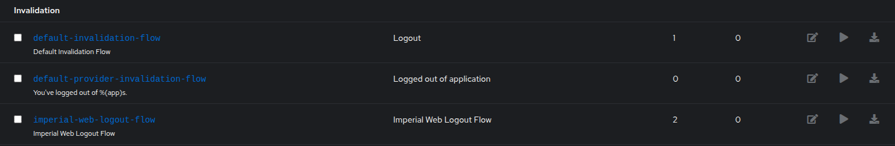

Select the Stage Bindings tab

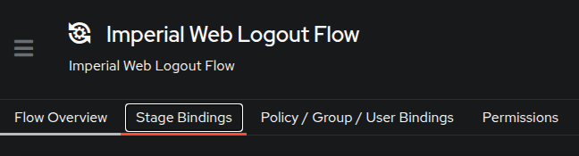

Select Edit Stage under the OIDC Post-Logout Redirect

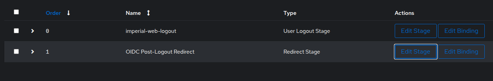

Set the Target URL to be the home/main page of the website:

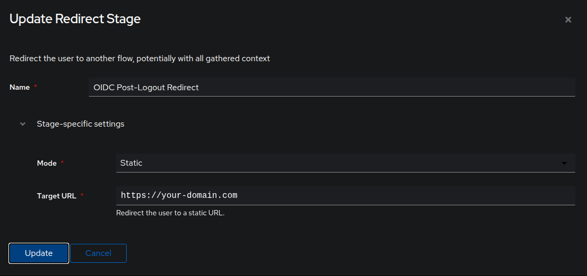

Mode: Static (default)

Target URL: https://\<your-domain\>.com

Select Update

Select Applications \> Applications (yes twice) \> create with provider

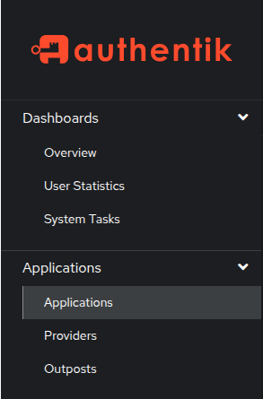

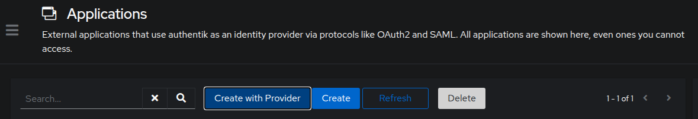

Name: Imperial Web

Slug (autogenerated) imperial-web

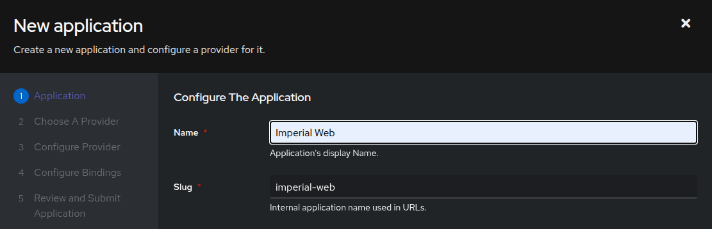

UI Settings (scroll down)\> Launch URL

Launch URL: https://
[your-domain.com](http://your-domain.com) (main page of
website)

Select Next

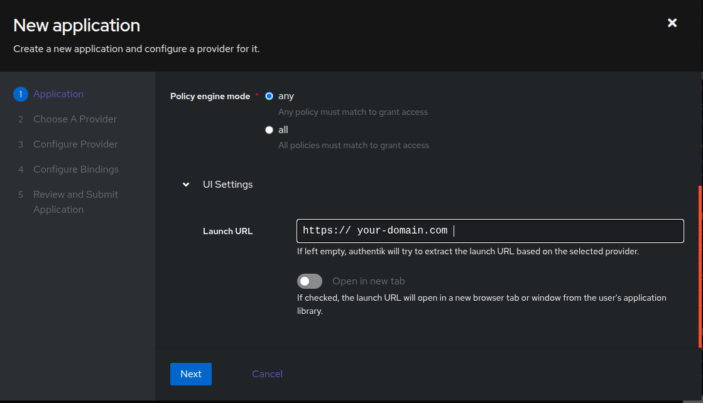

Select OAuth2/OpenID Provider

Select Next

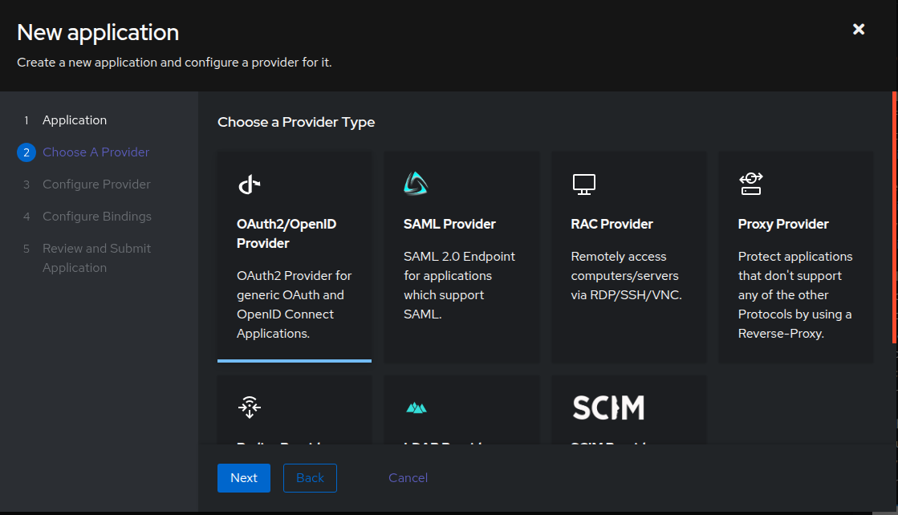

Name: imperial-oidc

Authorization Flow: explicit consent

Client Type: Confidential

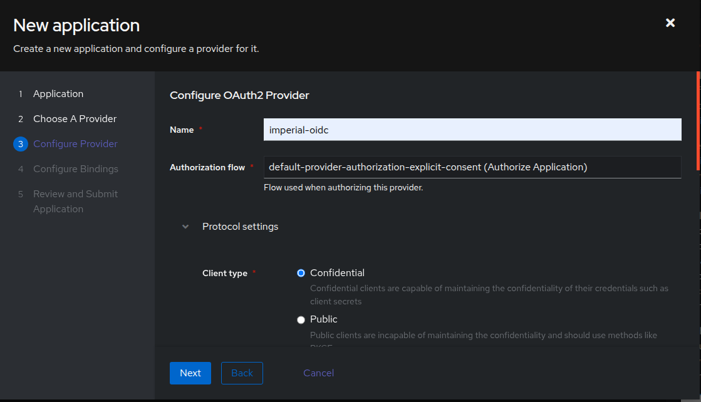

Client ID - Copy to .env

Client Secret - Copy to .env

Redirect URIs/Origins \> Add entry

Strict:
[https://your-domain/api/auth/callback](https://your-domain/api/auth/callback)

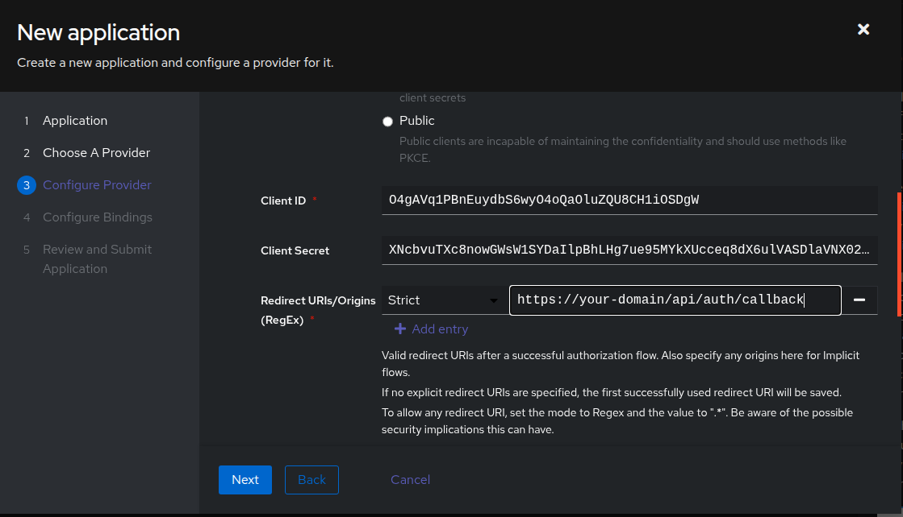

Advanced flow settings

Invalidation Flow: imperial-web-logout-flow

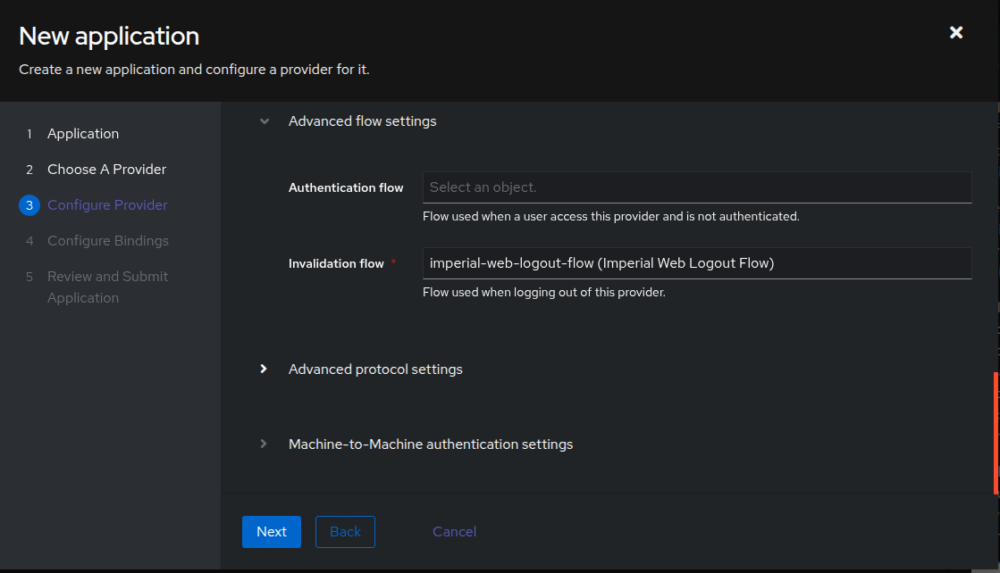

Advanced Protocol Settings

Select Based on the Users ID - (not the default hash)

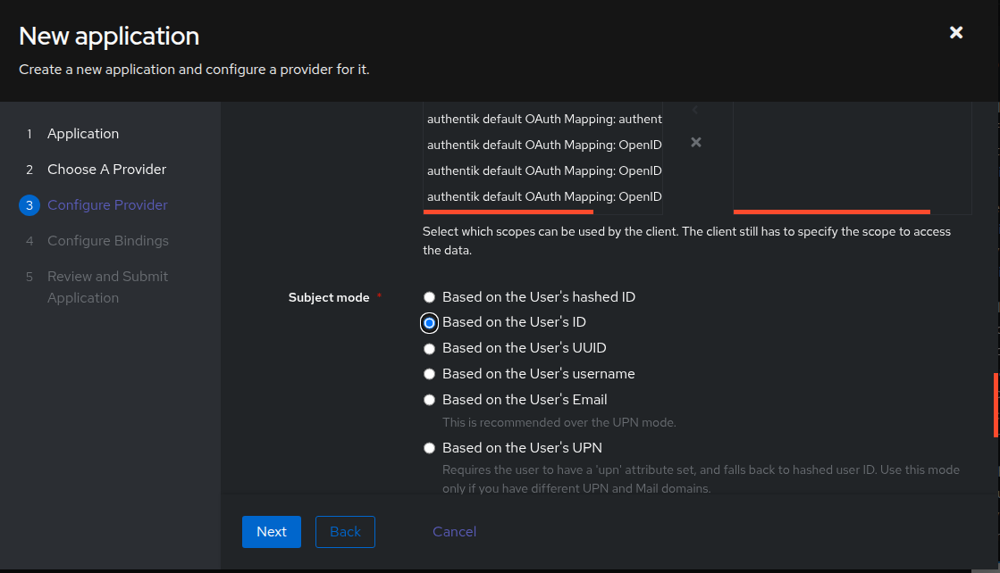

Select Next

Select next again

Select Submit

Close

Directory \> Groups

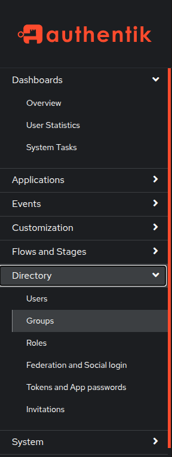

Select edit button on authentik-admins

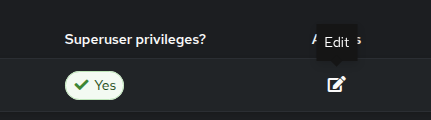

Change its name to "admins" (MUST be lowercase)

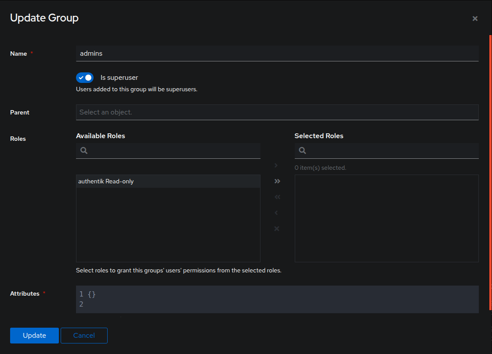

Select Update
